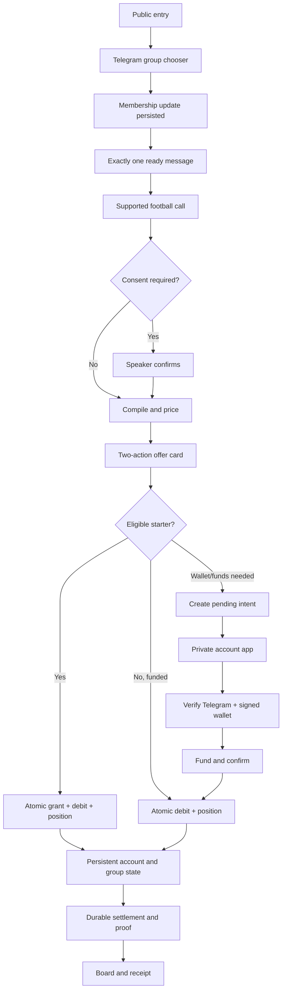

# Called It Production Readiness 9/10 Specification

Status: Proposed release specification
Target release: Public devnet beta
Product: Called It Telegram football-call product
Architecture: Telegram + grammY engine + Eve concierge + Next.js web + Supabase/PostgreSQL + Solana devnet + TxLINE
Baseline commit: `4837b57` on `codex/direct-onboarding`
Last updated: 2026-07-10

## 1. Purpose

This document is the authoritative specification for taking Called It from its
current partially integrated state to a production-ready public devnet beta in
which every product, UX, engineering, security, reliability, and operations
marker scores at least 9.0 out of 10.

This specification supersedes earlier release thresholds that allowed an
overall UX score of 8.2 or a production-readiness score of 8.0. An average can
hide a critical weakness. This release requires:

- Every scored marker is at least 9.0.
- Every mandatory check passes.
- Every hard gate passes.
- Evidence comes from the deployed commit and the real matching surface.
- No score is awarded from implementation claims or unit tests alone.
- Human usability remains explicitly unmeasured until a real cold cohort runs.

"Production" in this specification means a reliable public beta on Solana
devnet using test SOL with no monetary value. Mainnet, fiat, real-value
custody, gambling compliance, and a real-money launch are separate future
programs and cannot inherit this release decision.

## 2. Release Outcome

A cold Telegram group administrator must be able to add Callie directly to a
real group. Callie must become ready without a setup wizard. A member must be
able to make a real supported football call, give the minimum required consent,
and place one real 0.01 test-SOL starter position with one tap. The resulting
position, settlement, refund or payout, proof state, and receipt must remain
recoverable after interruption.

There is no demo, tutorial market, practice balance, scripted replay, fake
participant, fake liquidity, Rep economy, or raw wallet-address linking in the
production journey.

### 2.1 North-star events

The release has two activation events:

1. `group_ready`: an administrator adds Callie and exactly one ready message is
   committed and delivered within five seconds at p95.
2. `position_placed`: an eligible first-time member places exactly one 0.01
   test-SOL starter position within three seconds at p95 after tapping a side.

### 2.2 Success statement

The release succeeds when a user can move from the public entry point through
installation, consent, offer, position, account, settlement, proof, and receipt
without learning the internal engine/concierge split, remembering identifiers,
re-entering a pending position, encountering a dead command, or risking an
ambiguous money or identity mutation.

## 3. Scope

### 3.1 Required user features

| Capability | Required production behavior |
| --- | --- |
| Public entry | One dominant, valid, versioned Telegram group-add action on every relevant web and direct-message surface. |
| Group installation | Minimal Telegram rights, idempotent group registration, one concise ready message, and no setup wizard. |
| Football calls | Supported explicit, passive, and friend-triggered claim paths with deterministic parsing and clear ownership consent. |
| Offer card | Two primary outcome actions at the default 0.01 test-SOL amount and one requester-scoped amount chooser. |
| Starter position | Atomic once-per-user grant, debit, and position with a 5 SOL/500-user beta cap and disabled-first controls. |
| Existing balance position | Atomic idempotent debit and position without a starter grant. |
| Account | Private `/me` and account app surfaces for balance, verified wallet, starter status, open/pending/settled positions, and receipt links. |
| Wallet identity | Telegram-bound, expiring challenge plus canonical Solana `signMessage` verification and append-only link history. |
| Funding | Explicit devnet transfer details, confirmed attribution, preserved pending intent, and a separate final position confirmation. |
| Withdrawal | Verified linked wallet only, reserved balance, idempotent submission, durable recovery, and honest pending/failure state. |
| Group board | `/table` and web board with active/recent SOL calls and privacy-safe aggregates, never a Rep ranking. |
| Receipt | Compiled terms, stable group alias, pots, matched amount, refunds, payouts, participant count, settlement, and honest proof state. |
| Recovery | Stable next action for stale taps, unavailable services, wrong network, insufficient funds, closed markets, proof failure, and interrupted sessions. |

### 3.2 Required platform capabilities

- Route-scoped credentials and private engine networking.
- Durable at-least-once Telegram ingress.
- Durable outbound ownership resolution.
- Durable settlement reconciliation and proof jobs.
- Atomic money and identity RPCs.
- Privacy-safe public views and restricted realtime publication.
- Strict full-match TxLINE period parsing.
- Liveness, readiness, bounded cancellation, and bounded shutdown.
- PII-safe telemetry, metrics, traces, dashboards, and alerts.
- Full CI coverage for every workspace and production build.
- Fresh and upgraded database migration verification.
- Reachability-based dependency risk policy.
- Isolated staging and tagged fixture cleanup.
- Forward-only rollback and isolated point-in-time restore rehearsal.
- Disabled-first production canary and machine-validated scorecard.

### 3.3 Explicitly out of scope

- Solana mainnet or any real-value asset.
- Fiat display, purchase, cashout, or payment rails.
- Product fees or revenue mechanics.
- Rep balances, Rep stakes, Rep leaderboards, or streak economies.
- Demo or practice markets in the user journey.
- Fake participants, fake liquidity, or fake proof.
- Raw pasted-address wallet verification.
- Public Telegram names, usernames, IDs, wallet addresses, balances, positions,
  raw messages, claim quotes, or private ledger rows.
- A general-purpose trading dashboard.
- Replacing Telegram, TxLINE, Eve, Next.js, Supabase, Railway, Vercel, or the
  pure deterministic market engine.
- A broad visual redesign unrelated to activation, trust, recovery, or access.

## 4. Current Baseline

The baseline is not production-ready. It contains strong foundations but does
not yet expose a complete direct onboarding journey.

### 4.1 Accepted foundations

- SOL-only product, copy, consent, privacy, and design contract.
- Exact default-deny TxLINE market-period handling.
- Full monorepo CI and real PostgreSQL migration harness.
- Explicit disabled-first environment and rollout contract.
- Atomic starter-grant and stake database contract with real race, cap,
  privilege, rollback, linked-insufficient, and funded non-starter coverage.

### 4.2 Implemented but awaiting final acceptance

- Route-scoped engine trust boundaries and credential redaction.
- Liveness, readiness, bounded shutdown, and Telegram forwarding propagation.

These changes exist at baseline commit `4837b57`, but their independent final
reviews were interrupted and must restart from an immutable worktree.

### 4.3 Incomplete work in the shared worktree

The stopped Task 8 correction contains uncommitted edits that remove raw
`/wallet <pubkey>` linking. Those edits are not accepted release state. They
must be re-read, completed, tested, committed, independently reviewed, and
gated. The production specification must never treat dirty-worktree behavior
as delivered.

### 4.4 Major missing product surfaces

- Durable Telegram queues and ownership.
- Durable settlement and proof work.
- Privacy-safe SOL board and receipt views.
- Connected one-tap starter callback.
- Consent prompts and offer simplification.
- Complete install and navigation journey.
- Signed wallet/account APIs and Mini App.
- Hardened deposit, withdrawal, relink, and solvency lifecycle.
- Production landing entry, account app, group board, and complete receipts.
- Accessibility, browser, visual, and synthetic persona gates.
- Telemetry, dependency policy, staging, restore, canary, and final scoring.

## 5. Product Principles

### 5.1 Directness

Installation is setup. A real offer is participant onboarding. The product
must not ask a user to complete education before experiencing its actual value.

### 5.2 One primary action

Every state presents one dominant next action. Secondary detail is available
through progressive disclosure. Commands, cards, and web screens must not
present equal-weight walls of choices.

### 5.3 Commit before success

No API response, bot message, toast, callback acknowledgement, or analytics
event may claim success before the corresponding durable state commits.

### 5.4 Identity before authority

Telegram identity must come from a verified update or Mini App `initData`.
Solana identity must come from a canonical signed challenge. Model text,
caller-carried identity, pasted addresses, and public parameters grant no
authority.

### 5.5 Fail closed

Unknown periods, unknown payloads, malformed rows, wrong identity, expired
intents, stale callbacks, unavailable proof, and missing readiness dependencies
must refuse safely. They must not fall back to a permissive interpretation.

### 5.6 Durable recovery

Accepted work survives process death. A user must be able to recover from
interruption through durable account and job state rather than a remembered
message, toast, or identifier.

### 5.7 Honest trust

The product distinguishes committed, pending, matched, unmatched, refunded,
paid, submitted, unavailable, failed, and verified states. It never presents
proof success when bytes are missing or verification failed.

## 6. Users and Jobs

### 6.1 Installing administrator

Job: add Callie to a group and know that it is ready without configuring an
internal system.

Required outcome: no more than three user actions, exactly one ready message,
minimal Telegram rights, and a clear test-SOL/no-value statement.

### 6.2 Call maker

Job: express a supported football prediction naturally and control whether it
becomes a public position offer.

Required outcome: explicit claims proceed directly; passive or friend-triggered
claims require one speaker-owned confirmation with clear expiry and cancellation.

### 6.3 First-time participant

Job: understand the two outcomes and place the default position without first
learning wallets or funding.

Required outcome: one tap, one starter grant, one debit, one position, no wallet
prerequisite, and persistent success or refusal state.

### 6.4 Funded participant

Job: choose a side and amount and place an idempotent position immediately.

Required outcome: one position, exact balance change, and no duplicate effect
under repeat taps or delivery.

### 6.5 Wallet fallback participant

Job: preserve an intended position while verifying and funding a wallet.

Required outcome: no re-entry of group, market, side, or amount; no secret in a
URL or browser storage; explicit final confirmation after confirmed funding.

### 6.6 Returning participant

Job: find account, position, settlement, proof, and receipt state after leaving
Telegram or closing the account app.

Required outcome: desired state within two actions and no remembered ID.

### 6.7 Operations owner

Job: know whether the system is safe to accept work, reconcile gaps without
manual database repair, stop intake, restore service, and prove what changed.

Required outcome: bounded reason codes, dashboards, alerts, dry-run repair,
disabled-first controls, promotion manifest, and rehearsed rollback/restore.

## 7. End-to-End Experience



### 7.1 Entry

- Every visible primary CTA uses the configured Telegram bot username and the
  versioned `calledit_v1` start-group payload.
- The link requests only the minimum documented Telegram administrator rights.
- The build fails on missing, placeholder, stale, or malformed values.
- A secondary link may show a real receipt. It must not become a demo path.
- The public page must show enough of the actual product state to establish
  trust without becoming a marketing landing page.

### 7.2 Installation

- `my_chat_member` is persisted before routing or acknowledgement.
- Group creation and direct-mode configuration are idempotent.
- Ready-message delivery uses a logical ownership job before sending.
- Repeated membership and start updates produce one ready message.
- The ready message contains only what users need now: how to make a call, what
  Callie does, and that test SOL has no monetary value.
- Removal, insufficient rights, and reinstall states have one recovery action.

### 7.3 Claim and consent

- Deterministic prefiltering decides whether the engine owns a message before
  conversational routing.
- Explicit speaker-addressed claims can proceed directly.
- Passive detections require the speaker's confirmation.
- Friend-triggered claims can only publish after the quoted speaker confirms.
- Consent records bind speaker, group, source message, compiled candidate,
  expiry, and idempotency key.
- Editing, deleting, expiry, or conflicting confirmation fails safely.
- Model output can propose structure and copy but cannot choose identity,
  market acceptance, price, money, or settlement.

### 7.4 Offer

- The card renders deterministic compiled terms, not raw chat text.
- The two primary buttons use literal outcome labels and exact default amount.
- The default labels are semantically equivalent to:
  `It happens - 0.01 test SOL` and
  `It does not - 0.01 test SOL`.
- An amount chooser is secondary and requester-scoped.
- Close time, network, no-value status, and current position state are clear.
- Every callback binds user, group, market, side, amount, source, and immutable
  idempotency key derived from trusted Telegram data.

### 7.5 First position

- The database transaction owns starter eligibility, budget, credit, debit,
  and position creation.
- The fixed grant is 10,000,000 lamports once per Telegram user.
- The global beta cap is 5 SOL and 500 successful grants.
- A starter position is unavailable when intake, budget, market, side,
  solvency, identity, or idempotency checks fail.
- Every refusal writes zero grant, ledger, position, and budget mutations.
- Duplicate and concurrent taps return the original committed result.
- Telegram acknowledges the callback after the durable result is known.

### 7.6 Wallet and funding fallback

- Raw `/wallet <pubkey>` linking is removed or permanently fail-closed.
- The engine creates a five-minute challenge whose random material is returned
  once and whose SHA-256 hash is stored.
- The canonical message binds version, domain, Telegram user, Solana pubkey,
  devnet cluster, nonce, and expiry.
- The server verifies exact bytes and signature before consuming the challenge.
- Link history is append-only; an old pubkey remains reserved to its original
  Telegram user after relink.
- Relink requires zero balance, no non-void open/pending position, and no
  debited or submitted withdrawal.
- A pending stake intent binds user, group, market, side, lamports, internal
  correlation key, state, and ten-minute expiry.
- Browser access uses validated Telegram identity, never the internal key.
- Funding shows exact amount, target, network, and fee before wallet approval.
- Confirmed attribution changes the intent to ready; it does not place the
  position automatically.
- The user explicitly confirms the final preserved position.
- Closing and reopening restores the one active intent from server state.

### 7.7 Account and navigation

- `/me` is private personal state, not a public group message.
- `/table` opens or summarizes the privacy-safe group board.
- The private bot menu exposes account and relevant group navigation.
- Account shows balance, verified wallet, starter state, pending intent,
  positions, settlement, refund/payout, withdrawal, proof, and receipt links.
- The account app uses a secure first-party session cookie and in-memory CSRF.
- Session and CSRF rotate after wallet link, final position, and withdrawal.
- No session, challenge, intent key, init data, or signature is stored in a URL,
  local storage, session storage, analytics, or logs.

### 7.8 Settlement, proof, and receipt

- Terminal market discovery creates or repairs one settlement reconciliation
  job and one proof job per market.
- Ledger settlement effects, settlement row, proof state, and chat delivery are
  independently idempotent and convergent.
- Proof failure never reverses the settled money result.
- Public receipts use only stable per-group aliases and deterministic terms.
- Both pots, matched amount, unmatched refund, paid amount, participant count,
  outcome, proof tier, proof status, and verification detail are available.
- Unknown, private, partial, pending, unavailable, and failed states are honest
  and non-leaky.

## 8. Functional Requirements

### 8.1 Product and copy contract

- `PROD-001`: Active product guidance and user surfaces define one SOL/test-SOL
  economy and no current Rep behavior.
- `PROD-002`: No active onboarding surface contains demo, practice, replay, fake
  balance, or fake-liquidity language.
- `PROD-003`: Every visible command and CTA has a working destination or handler.
- `PROD-004`: Starter funds are described as limited beta test SOL with no
  monetary value, never free money or earnings.
- `PROD-005`: Consumer terms use calls, outcomes, position, amount, settlement,
  refund, payout, and proof consistently.
- `PROD-006`: A repository copy gate scans docs, bot, concierge, and web source
  and fails seeded forbidden fixtures.

### 8.2 Telegram ingress and ownership

- `TG-001`: Every allowlisted update receives a deterministic private source key.
- `TG-002`: The complete validated update commits before response or routing.
- `TG-003`: Duplicate source keys return the original routing decision.
- `TG-004`: Queue leases are exclusive, bounded, recoverable, and use skip-locked
  acquisition.
- `TG-005`: Permanent validation failures dead-letter once; transient failures
  retry with bounded exponential backoff and jitter.
- `TG-006`: Outbound ownership intent commits before Telegram send.
- `TG-007`: A send that may have succeeded but lacks ownership confirmation
  becomes `ownership_uncertain` and is reconciled rather than resent blindly.
- `TG-008`: Message ownership determines whether a reply returns to the engine
  or concierge; users do not learn this split.
- `TG-009`: Raw source keys and payloads never enter logs, metrics, evidence, or
  public tables.
- `TG-010`: Terminal ingress payloads follow seven-day retention; dead-letter
  and ownership data follow 30-day retention.

### 8.3 Money and solvency

- `MNY-001`: Ledger rows are append-only and amounts use integer lamports.
- `MNY-002`: Every mutation has an immutable idempotency key and original-result
  replay behavior.
- `MNY-003`: Starter credit and first debit/position are one transaction.
- `MNY-004`: Deposit attribution is verified, idempotent by transaction/index,
  and bound to the verified current wallet.
- `MNY-005`: Legacy orphan deposits are classified for operations and never
  auto-claimed after migration.
- `MNY-006`: Withdrawal reservation, submission, confirmation, release, and
  failure are durable and exactly reconciled.
- `MNY-007`: Relink cannot strand or transfer balance, positions, or withdrawal
  authority.
- `MNY-008`: The treasury coverage equation includes positive balances,
  open-position exposure, pending withdrawals, remaining starter cap, and fee
  reserve.
- `MNY-009`: Stake and starter intake fail closed whenever complete coverage is
  negative, stale, unavailable, or disabled.
- `MNY-010`: Reconciliation reaches zero unexplained ledger, position, deposit,
  withdrawal, settlement, and grant gaps.

### 8.4 Feed, settlement, and proof

- `FSP-001`: Only exact allowlisted full-match period values produce odds.
- `FSP-002`: Unknown, compound, half, extra-time, overtime, and penalty values
  produce a typed rejection and no market odds.
- `FSP-003`: Provider rejection telemetry contains bounded reason, hash, and
  length, never raw provider data.
- `FSP-004`: Settlement follows the deterministic market reducer and records
  evidence provenance.
- `FSP-005`: Settlement and proof jobs are durable, leased, retry-bounded,
  idempotent, and poison-job isolated.
- `FSP-006`: Reconciliation discovers every missing terminal effect and repairs
  or enqueues only the missing step.
- `FSP-007`: Completed public facts and verified proofs are immutable.
- `FSP-008`: Proof status is verified only when bytes verify against the
  expected on-chain root.
- `FSP-009`: Readiness exposes backlog count and oldest age without raw errors.

### 8.5 Public privacy

- `PRV-001`: Each group membership has a random stable `Player XXXXXXXX` alias
  unique within that group.
- `PRV-002`: The same Telegram user may have unrelated aliases across groups.
- `PRV-003`: Public views omit names, usernames, Telegram IDs, wallet addresses,
  balances, positions, private ledger rows, raw quotes, messages, and payloads.
- `PRV-004`: Receipt terms render from deterministic market specs only.
- `PRV-005`: Public aggregates reconcile exactly to private rows.
- `PRV-006`: Only safe settlement and proof rows for web-enabled groups are
  available to anonymous realtime consumers.
- `PRV-007`: Realtime is invalidation only; web re-reads curated views.
- `PRV-008`: Analytics accept only allowlisted event names and bounded metadata.
- `PRV-009`: Analytics actor and group values are namespace-separated HMAC
  pseudonyms with 30-day retention.

### 8.6 Web and account

- `WEB-001`: Landing, account, board, receipt, loading, empty, private, 404, and
  error screens are production-complete.
- `WEB-002`: The browser never calls a private engine route or Supabase write.
- `WEB-003`: Same-origin BFF routes validate Host, Origin, fetch metadata, session,
  CSRF, Telegram identity, and exact method.
- `WEB-004`: The session cookie is Secure, HttpOnly, SameSite Strict, Path `/`,
  host-only, and has a ten-minute maximum age.
- `WEB-005`: CSRF exists in React memory only and rotates with protected mutations.
- `WEB-006`: Wallet adapters sign only canonical bytes and reject unsupported
  `signMessage`, wrong wallet, wrong network, or changed challenge.
- `WEB-007`: All asynchronous states are recoverable and announced.
- `WEB-008`: Unknown and private identifiers return intentional non-leaky 404s.
- `WEB-009`: No required action depends on a third-party cookie.

### 8.7 Accessibility and language

- `A11Y-001`: Every page has one H1 and a valid heading hierarchy.
- `A11Y-002`: Every workflow is keyboard-completable with visible focus.
- `A11Y-003`: Interactive targets are at least 44 by 44 CSS pixels.
- `A11Y-004`: Critical text is at least 14px with zero negative letter spacing.
- `A11Y-005`: Focus indicators meet at least 3:1 contrast and are never hidden.
- `A11Y-006`: Status is not communicated by color, emoji, motion, or toast alone.
- `A11Y-007`: Async, funding, settlement, and proof changes use appropriate live
  regions without repeated or noisy announcements.
- `A11Y-008`: Reduced-motion settings remove nonessential animation.
- `A11Y-009`: 320px width, 200% text, and 400% zoom have no page-level horizontal
  scrolling, overlap, clipped action, or lost meaning.
- `A11Y-010`: Critical-path language passes at least 90% of fixed B1 comprehension
  checks and explains necessary chain terminology contextually.
- `A11Y-011`: Every error states what happened, whether money/state changed, and
  one next action.

## 9. State Machines

### 9.1 Telegram ingress

`received -> pending_engine | routed_concierge -> leased -> completed`

Retry branches:

`leased -> retry_wait -> leased`
`leased -> dead`
`leased -> lease_expired -> leased`

No update may skip durable receipt. Terminal state is immutable except retention
cleanup.

### 9.2 Outbound ownership

`planned -> sending -> owned -> complete`

Uncertain branch:

`sending -> lease_expired -> ownership_uncertain -> reconciled | manual_review`

`ownership_uncertain` must never auto-resend without authoritative evidence.

### 9.3 Consent

`candidate -> awaiting_speaker -> confirmed -> priced`

Terminal refusals:

`candidate | awaiting_speaker -> expired | cancelled | rejected | superseded`

Only confirmed consent may create a public offer when consent is required.

### 9.4 Wallet challenge

`issued -> consumed`

Terminal alternatives:

`issued -> expired | cancelled`

Challenge consumption and wallet link installation are one transaction. A
challenge is single-use even under concurrent completion.

### 9.5 Pending stake intent

`pending -> awaiting_funds -> ready -> consumed`

Terminal alternatives:

`pending | awaiting_funds | ready -> expired | cancelled`

Group, market, side, amount, and owner are immutable after creation. Consumed
intents replay the original result.

### 9.6 Settlement and proof work

`pending -> leased -> complete`

Failure branches:

`leased -> retry_wait -> leased`
`leased -> dead`

Each market has at most one logical reconciliation job and one logical proof
job. Completion facts are immutable.

### 9.7 Withdrawal

`requested -> reserved -> submitted -> confirmed`

Failure branches:

`requested | reserved -> cancelled`
`reserved | submitted -> retry_wait`
`reserved -> released`
`submitted -> manual_review`

No terminal failure may leave an unexplained reservation or duplicate transfer.

## 10. API and Trust Boundaries

### 10.1 Public engine routes

- `GET /api/live`: process-only liveness, always independent of external systems.
- `GET /api/ready`: sanitized readiness status and stable reason codes.

### 10.2 Concierge-scoped engine routes

The concierge credential may read group/market/account context, request a
read-only quote, create validated account/stake intents, and write allowlisted
events. It cannot call Telegram ingress or operations routes.

### 10.3 Telegram-scoped engine routes

The Telegram credential may persist accepted updates and resolve reply
ownership. It cannot read private account state, place direct positions, or call
operations routes.

### 10.4 Operations-scoped engine routes

The operations credential may read bounded status and invoke explicitly
designed reconciliation operations. It cannot impersonate a Telegram user or
bypass wallet/position identity.

### 10.5 Web to concierge boundary

`WEB_CONCIERGE_TOKEN` authenticates only server-side same-origin account/event
bridge calls. It grants no engine route directly. Browser requests carry a
verified account session and CSRF, never this credential.

### 10.6 Credential requirements

- All bearer tokens contain at least 32 random bytes or equivalent entropy.
- Engine tokens and the web concierge token are pairwise distinct.
- Comparison is constant time.
- Cross-service uniqueness uses non-authoritative SHA-256 fingerprints rather
  than distributing raw credentials to unrelated runtimes.
- Tokens are rejected in URLs, query strings, bodies, logs, errors, manifests,
  and evidence.
- Credential rotation follows disabled-first accepting-service-before-caller
  order with negative and positive route probes.

## 11. Security and Privacy Threat Model

| Threat | Required mitigation and proof |
| --- | --- |
| Telegram identity spoofing | Server-validated update or Mini App init data; caller-carried IDs have no authority. |
| Wallet takeover | Canonical signed challenge, five-minute expiry, one-time consumption, append-only history, permanent pubkey reservation. |
| Cross-scope credential use | Route allowlist, 401/403 distinction, constant-time comparison, pairwise uniqueness preflight. |
| Secret leakage | Recursive structured redaction, stable error codes, sentinel tests through live HTTP and logs. |
| Duplicate position or grant | Immutable idempotency, transaction locks, uniqueness constraints, duplicate/concurrency/restart tests. |
| Partial money write | One database transaction and injected rollback probes for every refusal and failure point. |
| Insolvency | Complete coverage equation, readiness gate, intake switches, database budget authority, alerts. |
| Accepted update loss | Durable receipt before acknowledgement, leased retries, dead letter, restart tests. |
| Duplicate Telegram send | Planned ownership before send, ownership uncertainty, reconciliation rather than blind resend. |
| Public PII exposure | Curated aggregate views, stable random aliases, restricted realtime, schema/value sentinel tests. |
| Model prompt injection | Structured boundaries, tool allowlists, model cannot choose identity, price, money, or settlement. |
| TxLINE ambiguity | Exact full-string allowlist and default-deny normalization. |
| CSRF/session theft | Secure host cookie, same-origin validation, in-memory CSRF, rotation, bounded key overlap. |
| Dependency compromise | Lock integrity, secret scanning, reachable advisory policy, expiring waivers. |
| Deployment drift | Commit/lock/migration/build manifest and deployed-ID verification. |

## 12. Reliability and Service Objectives

### 12.1 User-facing SLOs

| Measure | Target |
| --- | ---: |
| Group ready latency | p95 <= 5 seconds |
| Offer latency for supported claim | p95 <= 5 seconds |
| Default starter position latency | p95 <= 3 seconds |
| Existing-balance position latency | p95 <= 3 seconds |
| Installed-wallet fallback completion | p95 <= 90 seconds under controlled devnet conditions |
| Account state load | p95 <= 2 seconds |
| Board/receipt server response | p95 <= 2 seconds excluding third-party explorer navigation |
| Duplicate money effects | exactly zero |
| Accepted update loss | exactly zero |
| Unexplained terminal state | exactly zero |

### 12.2 Platform SLOs

| Measure | Target |
| --- | ---: |
| Required readiness success during canary | >= 99.9% over observation window |
| Ingress oldest ready work | <= 30 seconds |
| Feed age during active pricing | <= 60 seconds |
| Settlement oldest ready work | <= 2 minutes |
| Proof oldest ready work | <= 10 minutes |
| Withdrawal oldest actionable work | <= 5 minutes |
| Shutdown drain | <= 15 seconds |
| Broad-beta RPO | <= 15 minutes |
| Broad-beta RTO | <= 60 minutes |
| Hard-alert response during canary | automatic intake disable or rollout abort |

### 12.3 Readiness semantics

An intentionally disabled capability is reported but remains ready. Once a
feature switch is enabled, every required dependency becomes fail-closed.
Readiness returns only stable reason codes and never balances, secrets, raw
errors, source payloads, or private identifiers.

## 13. Observability

### 13.1 Structured event contract

Every event contains only allowlisted fields:

- Timestamp and schema version.
- Request, transition, job, market, fixture, and activation-session IDs.
- HMAC-pseudonymous actor, group, and Telegram source identifiers.
- Event and stable reason code.
- Attempt, duration, and bounded numeric metadata.
- Network, proof, settlement, and position state when relevant.

Events never contain raw claim text, message/update payload, Telegram name or
ID, raw source key, wallet address, signature, init data, authorization header,
IP address, session material, or nested raw error text.

### 13.2 Required funnel events

`entry_viewed -> add_group_clicked -> bot_added -> group_ready ->
claim_detected -> claim_confirmed_if_required -> claim_priced | claim_failed ->
offer_rendered -> stake_tapped -> starter_granted | wallet_required ->
position_placed | stake_refused -> wallet_setup_started -> wallet_verified ->
deposit_confirmed -> pending_stake_confirmed -> settlement_seen -> receipt_opened`

Every transition is idempotent. Duplicate delivery produces one analytics row.

### 13.3 Required alerts

- Required readiness failed for more than two minutes.
- Ingress oldest work exceeds 30 seconds.
- Any ingress or ownership dead letter exists.
- Feed age exceeds 60 seconds during active coverage.
- Settlement oldest work exceeds two minutes.
- Proof oldest work exceeds ten minutes.
- Withdrawal oldest work exceeds five minutes.
- Complete solvency remaining coverage is nonpositive.
- Starter budget reaches 80%, 95%, or 100%.
- Group-ready p95 exceeds five seconds.
- Offer p95 exceeds five seconds.
- Default-position p95 exceeds three seconds.
- Privacy or credential sentinel appears anywhere outside its private fixture.

Every alert requires a synthetic fire and recovery test.

## 14. Testing and Evidence Strategy

### 14.1 Testing principles

- Test external behavior and invariant state, not module export shape or source
  text as sole evidence.
- Mocks verify adapter argument/result mapping only. Real PostgreSQL, live HTTP,
  grammY updates, production Next builds, browser interaction, and controlled
  Solana adapters prove system behavior.
- Every mutation has a happy path, refusal path, duplicate path, concurrency
  path, restart path, and cleanup assertion where applicable.
- A passing test command is not evidence if it skipped the relevant surface.
- Test artifacts contain no secret, PII, raw source key, or wallet material.

### 14.2 Required automated layers

| Layer | Required coverage |
| --- | --- |
| Pure unit | Claim compiler, pricing, reducer, period normalization, parsers, formatters, state transitions. |
| Database unit/facade | Unknown-boundary parsing, typed outcome mapping, argument contracts, error handling. |
| Real PostgreSQL | Fresh/upgrade migrations, RPC atomicity, races, privileges, RLS, realtime, retention, exact ledger and aggregate arithmetic. |
| Engine grammY | Membership, claims, consent, callbacks, duplicate updates, commands, menu, failure propagation. |
| Live HTTP | Public health, scoped 401/403/2xx, redaction, malformed boundaries, drain refusal, BFF origin/session/CSRF. |
| Restart/fault | Process kill after durable acceptance, lease expiry, Telegram send uncertainty, settlement/proof/deposit/withdrawal interruption. |
| Browser | Landing, account, board, receipt, every outcome/proof/error state and navigation path. |
| Accessibility | Axe, keyboard, focus, headings, live regions, reduced motion, 320px reflow, 200% text, 400% zoom. |
| Visual | Fixed screenshots at 375x812, 768x1024, 1280x900, and 320px reflow. |
| Security | Credential scope, sentinel redaction, RLS/privilege, session/CSRF, signature binding, dependency policy. |
| Operations | Staging isolation, manifest, alert fire/recover, dry-run reconciliation, rollback, restore, canary abort. |

### 14.3 Synthetic personas

Run at least 12 cold sessions covering:

1. Installing administrator.
2. Crypto novice.
3. Experienced Solana user.
4. Distracted administrator.
5. B1-English reader.
6. Keyboard user.
7. Low-vision/reflow user.
8. Screen-reader semantics user.
9. Interrupted returning user.
10. Duplicate tapper.
11. Wrong-wallet or wrong-network user.
12. Service-outage and proof-unavailable user.

Each persona must complete the relevant workflow without helper intervention.
The harness must also prove it fails when disposable fixtures inject a duplicate
position, privacy leak, overflow, missing accessible name, and console error.

### 14.4 Evidence integrity

Every release artifact records:

- Reviewed commit SHA.
- Evidence schema version.
- Command and scenario ID.
- Start/end time.
- Environment and deployment identifiers without secrets.
- Result and stable failure reason.
- Artifact hash.
- Cleanup result.

Evidence from an older commit, different environment, dirty worktree, or skipped
surface does not count.

## 15. The 9/10 Scorecard

### 15.1 Scoring rule

Each marker has ten equally weighted machine-verifiable checks. The score is
the number of passing checks, from 0 to 10. A marker passes release only at 9 or
10, and every check marked mandatory must pass. A hard gate forces `no_go`
regardless of score.

No discretionary points, partial credit, or manual score overrides are allowed.
Skipped or stale checks count as failures.

### 15.2 Marker 1: Feature completeness

1. Public add-to-group entry works. Mandatory.
2. Idempotent group-ready flow works. Mandatory.
3. Explicit/passive/friend consent paths work. Mandatory.
4. Two-choice offer and amount chooser work.
5. Starter and funded positions work atomically. Mandatory.
6. Signed wallet, funding, and final confirmation work. Mandatory.
7. `/me`, `/table`, account, and board work.
8. Settlement, proof, and receipt closure work. Mandatory.
9. Recovery works for every fixed failure state. Mandatory.
10. No visible dead, placeholder, demo, Rep, or raw-link surface exists. Mandatory.

### 15.3 Marker 2: Entry and installation UX

1. Every CTA uses the current versioned Telegram URL. Mandatory.
2. 11/12 cold admins identify the next action without help.
3. 11/12 complete installation in no more than three actions. Mandatory.
4. Group ready p95 is no more than five seconds. Mandatory.
5. Exactly one ready message appears under duplicate delivery. Mandatory.
6. Minimal requested rights are clear.
7. Missing-rights and reinstall states have one recovery action.
8. Mobile and desktop links work.
9. Test-SOL/no-value status is understood by at least 11/12.
10. No setup wizard, checklist, demo, or command wall appears. Mandatory.

### 15.4 Marker 3: Claim and consent UX

1. Supported explicit claims reach the correct offer.
2. Passive claims require speaker confirmation. Mandatory.
3. Friend-triggered claims require quoted-speaker confirmation. Mandatory.
4. Wrong users cannot confirm. Mandatory.
5. Expired, edited, deleted, and superseded candidates fail safely.
6. Offer p95 is no more than five seconds.
7. 11/12 understand whether a call is public.
8. Every refusal gives one next action.
9. Raw chat is never public. Mandatory.
10. Model failure cannot mutate a market or consent record. Mandatory.

### 15.5 Marker 4: Offer and first-position UX

1. Two outcome buttons are correctly understood by 11/12.
2. Exact amount is visible before tap. Mandatory.
3. Eligible first-time user completes in one tap. Mandatory.
4. Default position p95 is no more than three seconds.
5. One tap creates one grant, debit, and position. Mandatory.
6. Ten duplicate deliveries create no duplicate effect. Mandatory.
7. Concurrent distinct taps cannot consume two starter grants. Mandatory.
8. Refusal states identify whether balance changed.
9. Success persists in account state after chat interruption.
10. Amount chooser is requester-scoped and cannot alter another user.

### 15.6 Marker 5: Account, wallet, funding, and withdrawal UX

1. Telegram identity is validated server-side. Mandatory.
2. Canonical wallet signature verification works. Mandatory.
3. Raw pasted address cannot link. Mandatory.
4. Pending intent preserves all position fields.
5. Reload/reopen restores safe state without local secrets.
6. Funding details and final confirmation are distinct and clear.
7. Wrong wallet/network/signature makes no mutation. Mandatory.
8. Relink blockers preserve identity and money. Mandatory.
9. Withdrawal is idempotent and recoverable. Mandatory.
10. Installed-wallet cold path completes within 90 seconds at p95.

### 15.7 Marker 6: Board, receipt, settlement, and proof trust

1. Board shows active and recent SOL calls.
2. Receipt terms come from deterministic specs. Mandatory.
3. Both pots and matched amount reconcile exactly. Mandatory.
4. Refund and payout reconcile exactly. Mandatory.
5. Stable alias is the only participant identity. Mandatory.
6. Pending/unavailable/failed proof is honest. Mandatory.
7. Verified badge requires successful byte verification. Mandatory.
8. Live settlement/proof updates do not require reload.
9. Private and unknown resources are non-leaky.
10. Board-to-receipt-to-group navigation is complete.

### 15.8 Marker 7: Accessibility and language

1. Zero serious or critical axe finding. Mandatory.
2. Keyboard completes every critical workflow. Mandatory.
3. Focus is visible and correctly ordered.
4. One H1 and valid headings exist on every page.
5. 320px/200%/400% reflow has no clipping or overlap. Mandatory.
6. Async states are announced appropriately.
7. Reduced motion is respected.
8. Meaning never depends on color, emoji, animation, or toast. Mandatory.
9. At least 90% of B1 comprehension assertions pass.
10. Every error follows the three-part recovery contract. Mandatory.

### 15.9 Marker 8: Recovery and consistency

1. Duplicate update converges to one result. Mandatory.
2. Engine restart after acceptance loses no update. Mandatory.
3. Concierge failure propagates for retry. Mandatory.
4. Telegram send uncertainty does not duplicate a message. Mandatory.
5. Interrupted wallet flow resumes.
6. Closed/stale market preserves money and gives one next action.
7. Unavailable proof preserves settlement and states limitation.
8. Deposit/withdrawal interruption converges. Mandatory.
9. Reconciliation ends with zero unexplained gaps. Mandatory.
10. Cross-surface copy and state are consistent.

### 15.10 Marker 9: Security, identity, and privacy

1. Route scopes pass positive and negative probes. Mandatory.
2. Pairwise token uniqueness is deployably enforced.
3. Sentinel secrets never appear in logs/evidence. Mandatory.
4. Telegram and wallet identity cannot be swapped. Mandatory.
5. Session, CSRF, origin, host, and fetch-metadata checks pass. Mandatory.
6. Anonymous/authenticated roles cannot reach private tables/RPCs. Mandatory.
7. Public views contain no forbidden field or sentinel value. Mandatory.
8. Realtime leaks no private-group event. Mandatory.
9. Model and external text cannot grant authority. Mandatory.
10. Secret scan and lock-integrity checks pass.

### 15.11 Marker 10: Ledger and solvency

1. Starter path is atomic. Mandatory.
2. Funded path is atomic. Mandatory.
3. Every refusal writes nothing. Mandatory.
4. Cap and budget remain exact under races. Mandatory.
5. Deposit attribution is exact and idempotent. Mandatory.
6. Withdrawal reserve/submission/confirmation is exact. Mandatory.
7. Settlement payout/refund is exact. Mandatory.
8. Relink cannot transfer or strand liability. Mandatory.
9. Complete treasury coverage remains nonnegative. Mandatory.
10. Fault matrix produces zero duplicate or orphan money effect. Mandatory.

### 15.12 Marker 11: Feed, jobs, and delivery durability

1. Ambiguous periods are rejected. Mandatory.
2. Ingress persists before acknowledgement. Mandatory.
3. Lease exclusion/recovery works. Mandatory.
4. Permanent failures dead-letter without blocking others.
5. Ownership uncertainty reconciles without blind resend. Mandatory.
6. Settlement jobs survive restart. Mandatory.
7. Proof jobs survive restart. Mandatory.
8. Poison market does not block sweep.
9. Backlog and oldest-age queries are exact.
10. Retention removes only eligible terminal data.

### 15.13 Marker 12: CI, schema, and dependency quality

1. Frozen install succeeds.
2. Every workspace builds, including concierge. Mandatory.
3. Every workspace typechecks.
4. Every nonempty test suite runs; zero-test escape fails. Mandatory.
5. Fresh migration path passes. Mandatory.
6. Upgrade migration path passes. Mandatory.
7. SQL concurrency/RLS/privilege suite passes. Mandatory.
8. Browser/accessibility suite passes twice deterministically.
9. No reachable unwaived critical/high/moderate advisory. Mandatory.
10. Workflow, lock, secret, and evidence policy checks pass.

### 15.14 Marker 13: Observability and readiness

1. Liveness remains process-only.
2. Enabled dependency failures make readiness fail. Mandatory.
3. Disabled capabilities remain explicitly ready.
4. Every queue heartbeat/backlog is represented.
5. PII-safe funnel events emit exactly once.
6. Local OTLP collector receives bounded signals.
7. Every alert fires under its synthetic breach. Mandatory.
8. Every alert resolves after recovery.
9. Reconciliation dry-run is deterministic and write-free. Mandatory.
10. Unsafe apply is rejected.

### 15.15 Marker 14: Deployment, backup, and operations

1. Staging and production resource IDs differ. Mandatory.
2. Promotion manifest matches commit, lock, migrations, and builds. Mandatory.
3. Engine private networking and scoped auth pass.
4. Web source/build is current.
5. Webhook is correct with zero unexpected backlog.
6. Disabled-first capability order is followed. Mandatory.
7. Canary has no hard alert or unexpected dead letter. Mandatory.
8. Isolated PITR restore reproduces invariants. Mandatory.
9. RPO <=15 minutes and RTO <=60 minutes. Mandatory.
10. Forward-only app rollback and roll-forward reconcile. Mandatory.

## 16. Hard Gates

Any one of the following forces `no_go` regardless of scores:

- Duplicate, partial, or insolvent money result.
- Identity takeover, cross-user wallet assignment, or authority from unverified
  caller-carried data.
- Public PII, wallet, balance, raw claim, secret, session, signature, or source
  key exposure.
- Accepted ambiguous TxLINE period.
- Lost accepted Telegram update or durable job.
- Blind duplicate resend after uncertain Telegram delivery.
- Serious or critical accessibility violation.
- Failed fresh or upgrade migration.
- Failed restore, rollback, or invariant comparison.
- Stale or mismatched deployed source.
- Required readiness failure.
- Missing, stale, redacted incorrectly, or unhashed evidence artifact.
- Any scored marker below 9.0.

## 17. Delivery Workstreams

### 17.1 Gate A: Stabilize the current foundation

Deliverables:

- Restart and complete independent reviews for route auth and runtime health.
- Complete the stopped verified-wallet correction.
- Remove every raw wallet-link mutation path.
- Split oversized production modules below the repository LOC ceiling.
- Re-run immutable code review and final gates.

Exit: foundation tasks 1 through 8 are accepted with no dirty-worktree claim.

Estimated effort: 2 to 4 engineering days.

### 17.2 Gate B: Durable private data foundations

Deliverables:

- Telegram ingress, routing, ownership, heartbeat, retention, and redaction.
- Settlement reconciliation and proof job storage.
- Stable aliases, aggregate SOL views, safe realtime, and onboarding events.

Exit: migrations apply fresh and as upgrade; races, privileges, RLS, retention,
and privacy sentinels pass in real PostgreSQL.

Estimated effort: 5 to 8 engineering days.

### 17.3 Gate C: Engine and Telegram journey

Deliverables:

- One-tap starter callback.
- Consent state machine and simplified offer.
- Idempotent group installation, navigation, and ready message.
- Wallet/account/intents engine APIs.
- Durable concierge routing and message ownership.
- Durable settlement/proof/chat workers.
- Deposit, withdrawal, relink, solvency, and orphan handling.

Exit: grammY, API, duplicate, restart, identity, and money scenarios converge.

Estimated effort: 8 to 12 engineering days.

### 17.4 Gate D: Complete user-facing web journey

Deliverables:

- Real public add action.
- Secure contextual Telegram account app.
- Privacy-safe group board and complete receipts.
- Consistent recovery language and accessibility.
- Deterministic Playwright, visual, console, network, and axe gates.

Exit: every fixed viewport and workflow passes twice from production builds.

Estimated effort: 7 to 10 engineering days.

### 17.5 Gate E: Operations and release

Deliverables:

- Telemetry, dashboards, alerts, scorecard, and reconciliation CLI.
- Dependency remediation and expiring waiver policy.
- Isolated staging, webhook, resources, seed, cleanup, and promotion manifest.
- Twelve-persona fault matrix.
- PITR restore and forward-only rollback rehearsal.
- Production canary and final scoring.

Exit: every marker is at least 9.0, all hard gates pass, and release output is
`limited_beta_go`.

Estimated effort: 8 to 12 engineering days plus observation time.

### 17.6 Expected timeline

Under the assumptions of one senior engineer with agent assistance, prompt
review cycles, and available external credentials:

- Starter-only allowlisted beta: approximately 3 to 5 weeks if signed wallet,
  deposit, and withdrawal features remain disabled rather than half-shipped.
- Full wallet-enabled public devnet beta specified here: approximately 6 to 9
  weeks.
- Part-time solo delivery or delayed external provisioning: approximately 10
  to 14 weeks.

These are engineering estimates, not a commitment. The release date moves when
a hard gate fails; the threshold does not move.

## 18. Deployment and Promotion

### 18.1 Staging

- Use isolated Supabase, Railway, Vercel, Telegram, route tokens, session keys,
  analytics keys, and devnet treasury.
- Prove no resource ID equals production.
- Apply all migrations fresh and as an upgrade clone.
- Keep wallet, stake, starter, and treasury-coverage switches disabled.
- Deploy engine, concierge, then web from one reviewed commit.
- Set webhook last after private routes and readiness pass.
- Seed only tagged synthetic fixtures and prove cleanup leaves controls intact.

### 18.2 Production

- Confirm backup/PITR and current restore evidence.
- Apply forward migrations with intake and budget disabled.
- Deploy engine, then concierge, then web.
- Require source, lock, migration, build, readiness, route-auth, privacy, and
  public smoke checks after each step.
- Set webhook last.
- Enable one allowlisted canary group.
- Enable wallet, stake, database budget, and starter grants in that order.
- Require complete treasury coverage before stake and again before starter.
- Observe at least 30 minutes with automatic abort on hard alerts.
- Expand deliberately; do not open broad beta automatically.

### 18.3 Abort

1. Disable starter grants.
2. Disable stake acceptance.
3. Disable wallet app if identity/session behavior is implicated.
4. Disable the authoritative database starter budget.
5. Preserve forward schema and durable work.
6. Restore previous web, concierge, and engine deployments only after intake is
   confirmed off.
7. Reconcile, verify invariants, and only then roll forward.

## 19. Definition of Done

A requirement or work item is complete only when:

- Product behavior is implemented on the reviewed branch.
- The implementation has focused tests appropriate to its risk.
- Real system-boundary tests pass where applicable.
- Production files satisfy type safety, no-excuse, and size rules.
- Independent code review returns PASS.
- Manual/surface QA drives the matching artifact.
- Adversarial final verification confirms current evidence.
- Evidence is redacted, hashed, cleanup-confirmed, and tied to the commit.
- The corresponding scorecard checks are recomputed.

The release is complete only when:

- All required features in this specification are present.
- Every marker is at least 9.0.
- Every mandatory check passes.
- No hard gate fails.
- Staging, restore, rollback, and production canary pass.
- The scorecard validator emits `limited_beta_go`.
- Human onboarding is reported as `not_yet_measured` until a real cohort runs.

## 20. Final Independent Verification

Four independent lanes run after all implementation work:

1. Plan compliance maps every requirement, state, acceptance criterion, marker,
   and hard gate to current evidence.
2. Code quality and security review audits the complete diff, database, auth,
   identity, privacy, queues, money, tests, and dependency posture.
3. Real surface QA drives Telegram, live APIs, production-build web, controlled
   devnet flow, settlement, proof, receipt, bad inputs, restart, rollback, and
   restore.
4. Scope and release review proves no demo, Rep, mainnet, fake liquidity, PII,
   new architecture, or unrelated redesign entered and recomputes the release
   decision.

All four must return APPROVE. A timeout, skipped lane, inconclusive result, or
missing artifact is a failure, not an approval.

## 21. Product Decision

The product should not expose a partially safe wallet workflow merely to claim
feature completeness. The supported choices are:

- Ship the full verified wallet, funding, withdrawal, recovery, and operations
  contract in this specification; or
- Keep every wallet/funding/withdrawal entry disabled and ship an allowlisted
  starter-only beta while that work continues.

Raw address linking, half-implemented identity, or an unrecoverable funding
flow is not an acceptable intermediate production state.

The preferred sequence is a small starter-only canary followed by the full
wallet-enabled public devnet beta after every marker reaches 9.0.

## Appendix A. Architecture Ownership

| Module | Production responsibility | Prohibited responsibility |
| --- | --- | --- |
| Market engine package | Pure deterministic claim compilation, pricing, reducer, debounce, and settlement evaluation. | I/O, clocks, environment, Telegram identity, balances, public aliases, or proof execution. |
| TxLINE package | Provider transport, schema parsing, exact normalization, cursor/live sources, and provenance. | Product mutation, permissive period fallback, or public provider payload exposure. |
| Agent package | Deterministic prefilter plus model-assisted classify, parse, and persona output. | Identity, authority, price invention, money mutation, market acceptance, or settlement. |
| Database package | Forward migrations, typed facades, atomic RPCs, append-only money, durable queues, identity history, and curated public views. | Product-language decisions or duplicate business state machines outside transactional invariants. |
| Solana package | Canonical signing helpers, devnet transfers, treasury adapter, oracle submission, and isomorphic proof verification. | Telegram authority, private-key exposure, or silent network switching. |
| Engine app | The only product-state writer; owns grammY, consent, offers, callbacks, ingest, money orchestration, settlement, proof, and private API. | Public service-role exposure or trusting model/browser-carried identity. |
| Concierge app | Private conversation, verified-session context, and scoped private engine API calls. | Direct database access, independent product facts, direct model-facing position commits, or workspace package imports. |
| Web app | Public entry, same-origin account bridge, aggregate board, and receipt rendering. | Direct private-engine calls, Supabase writes, raw identity display, or raw chat fallback. |

The engine remains the single writer. The web reads curated public views. The
concierge mutates only through scoped engine APIs. The pure market engine stays
free of adapters and external state.

## Appendix B. Required Data Contracts

| Contract | Required private state | Required invariants |
| --- | --- | --- |
| Starter budget | Enabled state, grant amount, cap amount, max count, used amount/count. | Database-authoritative, locked during grant, cap never exceeded, disabled by default. |
| Starter grant | Telegram user, immutable grant key, exact amount, position and ledger linkage. | Once per Telegram user, append-only, created in the first-position transaction. |
| Wallet challenge | User, hash, expiry, consumed/cancelled timestamps. | Raw material never stored, five-minute TTL, one-time atomic consumption. |
| Wallet link history | User, pubkey, verified timestamp, challenge linkage, supersession. | Append-only, pubkey permanently reserved across users. |
| Current wallet link | User, verified current pubkey, history reference. | Installed only by verified RPC, one current link per user and pubkey. |
| Pending stake intent | User, group, market, side, lamports, state, expiry, internal correlation key. | Immutable terms, ten-minute TTL, one active owner-visible intent, one-time consumption. |
| Telegram update | Deterministic source key, private payload, route, attempts, lease, reason, timestamps. | Persist before acknowledgement, duplicate returns original route, private and retention-bounded. |
| Outbound ownership job | Logical domain reference, send state, Telegram IDs when known, lease, uncertainty. | Plan before send, do not complete before ownership commit, uncertain send is not blindly resent. |
| Worker heartbeat | Worker kind, instance, observed time, bounded status. | Private, readiness-readable, no secret/error payload. |
| Settlement job | One logical row per market, attempts, due time, lease, stable reason. | Idempotent enqueue and effects; poison market isolation. |
| Proof job | One logical row per market, attempts, due time, lease, stable reason. | Completed proof immutable; failure cannot reverse settlement. |
| Membership alias | Group membership and random stable alias. | Nonempty, group-unique, unrelated across groups, no Telegram-derived encoding. |
| Onboarding event | Idempotency key, session, event, HMAC actors, reason, latency, bounded metadata. | Allowlisted schema, no text/PII, exact-once transition, 30-day retention. |
| Public receipt view | Compiled terms, alias, aggregate pots, match/refund/payout counts and proof state. | No private identity or individual position data; exact aggregate reconciliation. |
| Public group board | Public group, active/recent compiled markets, aggregate activity. | No Rep ranking, no private group rows, deterministic terms only. |

Applied migrations are never edited. New contracts use forward-only migrations
in numeric order and refresh typed database boundaries after each migration.

## Appendix C. Implementation Traceability

The existing 30-item implementation program remains the execution breakdown.
This table binds every item to this specification and records the baseline
state. "Implemented, review pending" is not complete.

| Item | Deliverable | Baseline state | Specification coverage |
| ---: | --- | --- | --- |
| 1 | SOL product, consent, privacy, copy, and design contract | Accepted | Sections 2-5, 8.1 |
| 2 | Diagnostic removal and route-scoped trust | Implemented, review pending | Sections 10-11, Marker 9 |
| 3 | Exact TxLINE full-match handling | Accepted | Sections 8.4, Marker 11 |
| 4 | Liveness, readiness, cancellation, and shutdown | Implemented, review pending | Sections 12-13, Marker 13 |
| 5 | CI and build parity | Accepted | Section 14, Marker 12 |
| 6 | Explicit fail-closed environment and rollout | Accepted | Sections 10, 18 |
| 7 | Atomic starter grant and stake | Accepted | Sections 7.5, 8.3, Marker 10 |
| 8 | Verified wallet, history, and pending intents | Partial dirty-worktree correction | Sections 7.6, 9.4-9.5, Marker 5 |
| 9 | Durable Telegram ingress and ownership | Not started | Sections 8.2, 9.1-9.2, Marker 11 |
| 10 | Durable settlement and proof jobs | Not started | Sections 8.4, 9.6, Marker 11 |
| 11 | Privacy-safe aliases, SOL views, and events | Not started | Sections 8.5, 13, Marker 9 |
| 12 | One-tap starter callback | Not started | Sections 7.4-7.5, Marker 4 |
| 13 | Consent and simplified offer | Not started | Sections 7.3-7.4, Marker 3 |
| 14 | Installation, ready message, commands, and navigation | Not started | Sections 7.1-7.2, Marker 2 |
| 15 | Verified wallet/account/intent engine APIs | Not started | Sections 7.6-7.7, Marker 5 |
| 16 | Durable concierge routing and ownership | Not started | Sections 8.2, Marker 8 |
| 17 | Durable settlement, proof, and chat workers | Not started | Sections 7.8, 8.4, Marker 11 |
| 18 | Deposit, withdrawal, relink, solvency, and orphan hardening | Not started | Sections 8.3, 9.7, Marker 10 |
| 19 | Real public group-add entry | Not started | Sections 7.1, Marker 2 |
| 20 | Contextual Telegram account Mini App | Not started | Sections 7.6-7.7, 8.6, Marker 5 |
| 21 | Complete SOL board and receipts | Not started | Sections 7.8, Marker 6 |
| 22 | Accessibility, language, and recovery contract | Not started | Section 8.7, Marker 7 |
| 23 | Deterministic browser, visual, and accessibility tests | Not started | Section 14, Markers 7 and 12 |
| 24 | PII-safe telemetry, alerts, reconciliation, and scorecard | Not started | Section 13, Marker 13 |
| 25 | Dependency remediation and waiver policy | Not started | Sections 11 and 14, Marker 12 |
| 26 | Isolated staging and promotion manifest | Not started | Section 18.1, Marker 14 |
| 27 | Twelve-persona journey and fault matrix | Not started | Sections 14.3 and 15 |
| 28 | Forward-only rollback and PITR restore | Not started | Sections 12 and 18, Marker 14 |
| 29 | Gated production canary | Not started | Section 18.2, Marker 14 |
| 30 | Recompute all 9/10 markers and release decision | Not started | Sections 15-16, Appendix D |
| F1 | Independent plan/spec compliance | Not started | Section 20 |
| F2 | Independent code/security quality review | Not started | Section 20 |
| F3 | Real matching-surface QA | Not started | Section 20 |
| F4 | Scope fidelity and final release decision | Not started | Section 20 |

## Appendix D. Machine Scorecard Contract

The release validator consumes evidence references, not manually entered scores.
A conceptual result has this shape:

```json
{
  "schema_version": 1,
  "release_commit": "full-git-sha",
  "environment": "production-canary",
  "human_onboarding": "not_yet_measured",
  "markers": [
    {
      "id": "feature_completeness",
      "passed_checks": 10,
      "required_checks": 10,
      "score": 10.0,
      "mandatory_passed": true,
      "evidence": [
        {
          "path": "redacted-artifact-path",
          "sha256": "artifact-hash",
          "commit": "full-git-sha"
        }
      ]
    }
  ],
  "hard_gates": {
    "passed": true,
    "failures": []
  },
  "decision": "limited_beta_go"
}
```

Validation rules:

- Exactly the 14 markers in Section 15 must exist once each.
- Every marker has exactly ten named checks.
- `score` is recomputed as `10 * passed_checks / required_checks`.
- Every marker score is at least 9.0.
- Every mandatory check passes.
- Evidence hashes resolve and match the release commit/environment.
- Missing, duplicate, stale, future-dated, malformed, or manually inflated
  evidence forces `no_go`.
- Any hard-gate failure forces `no_go`.
- The validator is read-only and cannot enable rollout switches.

## Appendix E. Feature Switch Contract

| Switch | Default | May turn on only when |
| --- | --- | --- |
| `WALLET_MINIAPP_ENABLED` | `false` | Signed identity, session/CSRF, origin, account API, browser, accessibility, and recovery checks pass. |
| `STAKE_ACCEPTANCE_ENABLED` | `false` | Durable ingress, atomic money, complete coverage, settlement recovery, readiness, and canary prerequisites pass. |
| `STARTER_GRANTS_ENABLED` | `false` | Stake intake is enabled and healthy, database budget is enabled, remaining cap is covered, and one canary grant is authorized. |
| `TREASURY_COVERAGE_ENFORCED` | `false` before provisioning | Complete current coverage query is available, fresh, nonnegative, readiness-bound, and alert-backed. |

Flags control exposure and intake, not authoritative amounts or caps. Grant
amount, budget, count, and remaining capacity remain database state.
