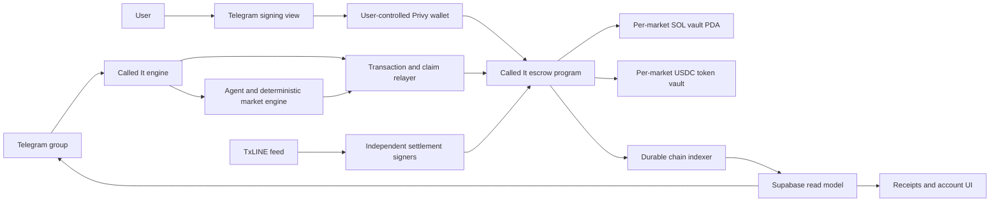

# Called It On-Chain Escrow Migration Plan

Status: Proposed implementation specification
Target: Devnet first, independently reviewed mainnet release second
Scope: Replace custodial Called It balances for new markets with user-signed,
program-controlled SOL and USDC escrow while preserving the current Telegram
call, odds, partial-matching, settlement, Points, receipt, and replay behavior.

## 1. Executive Summary

Called It currently uses a dedicated treasury wallet and an internal Supabase
ledger. Users deposit into the treasury, positions debit the internal ledger,
settlement reallocates ledger balances, and withdrawals send assets back from
the treasury.

The target architecture removes the treasury as discretionary custodian for new
markets:

1. The engine detects, compiles, and prices a call as it does today.
2. The engine creates an immutable market account in a Called It Solana program.
3. A Telegram position button opens a Privy-backed signing view.
4. The user signs a transaction that transfers SOL or USDC from their wallet to
   a market-specific program-controlled vault.
5. The program records the user's side and amount and enforces market limits.
6. Independent settlement signers attest to the TxLINE-backed result.
7. The program freezes the outcome and calculates claimable refunds and payouts.
8. Anyone may submit a claim transaction for a user, but funds can only be sent
   to that user's recorded wallet.
9. The Called It relayer normally pays claim transaction fees so settlement
   remains automatic from the user's point of view.

The program must never contain an admin instruction capable of arbitrarily
withdrawing market vault funds.

## 2. Goals

- Users retain custody until they explicitly approve each position.
- Open-position funds are controlled by program rules, not a Called It keypair.
- User payouts are funded only by deposited market assets.
- SOL and USDC have isolated vaults and accounting.
- The current locked-odds, partial-matching payout model is preserved exactly.
- One-sided and unmatched positions are refundable without house capital.
- Settlement is final, idempotent, and independently verifiable.
- No single engine key can steal escrow or settle a market unilaterally.
- Telegram remains the primary product surface.
- Normal users do not need to manually claim after every settlement.
- Devnet and mainnet use the same program behavior with separate program IDs,
  authorities, mints, RPC configuration, and operational limits.
- The existing custodial system remains available only to settle and withdraw
  legacy balances during migration.

## 3. Non-Goals For Version 1

- An automated market maker or house market maker.
- Cross-asset matching between SOL and USDC.
- Token-2022 assets or arbitrary SPL tokens.
- Leverage, credit, borrowing, negative balances, or house-funded odds.
- User cancellation after a position is confirmed.
- A global order book shared between groups.
- On-chain natural-language parsing or TxLINE HTTP access.
- Automatic migration of legacy balances without user authorization.
- A protocol fee. Version 1 launches with `fee_bps = 0`.
- Hidden custodial fallback when an escrow transaction fails.

## 4. Product And Trust Model

### 4.1 What remains off-chain

- Telegram installation and group membership.
- Claim detection and speaker consent.
- GLM parsing.
- Deterministic claim compilation and pricing.
- TxLINE ingestion and event normalization.
- Telegram cards, participant names, Points, and public receipt presentation.
- Relaying and indexing Solana transactions.

### 4.2 What moves on-chain

- Immutable market identity, asset, terms hash, quote, and deadlines.
- SOL or USDC custody for each market.
- User side and deposited amount.
- Position activation or refund state.
- Final settlement outcome and payout ratio.
- Claim status and asset transfers.
- Protocol pause state and authority epochs.

### 4.3 Remaining trust assumptions

On-chain escrow removes discretionary custody but does not automatically make
football data trustless. Version 1 uses threshold-signed settlement attestations:

- A market requires 2-of-3 configured settlement signers.
- Signers run independently and derive results from TxLINE-normalized evidence.
- The engine may be one signer but cannot settle alone.
- A signed attestation includes the market, fixture, outcome, deciding sequence,
  evidence hash, and oracle-set epoch.
- Anyone can submit a valid attestation; submission is not restricted to the
  Called It engine.
- A permissionless timeout void returns all positions if no valid settlement is
  available by the immutable resolution deadline.

This trust model must be disclosed accurately. A later program version may
verify richer TxOracle facts directly, but that must not weaken or silently
change Version 1 settlement rules.

## 5. Target Architecture



## 6. Protocol Invariants

These invariants are release-blocking and must have unit, property, integration,
and independent-review coverage.

1. **Conservation**

   ```text
   total claims paid + remaining vault assets = total successful deposits
   ```

   Rounding dust is explicit and cannot become negative.

2. **No house payout liability**

   ```text
   sum(user entitlements) <= market vault deposits
   ```

3. **Asset isolation**

   A SOL market can move only native SOL. A USDC market can move only the
   configured canonical USDC mint for that cluster.

4. **One side per wallet per market**

   A wallet may add to its existing side but cannot open the opposite side.

5. **Immutable economic terms**

   Asset, terms hash, quote probability, matching ratio, fee rate, cutoff,
   resolution deadline, and oracle-set epoch cannot change after the market is
   opened.

6. **Final settlement**

   A market can transition from open to settled or voided exactly once.

7. **No arbitrary vault withdrawal**

   Assets can leave a vault only through a validated refund, payout, or final
   dust/rent close after all user entitlements are discharged.

8. **Claims are destination-bound**

   Anyone may pay to execute a claim, but the program sends funds only to the
   wallet recorded in the position PDA.

9. **Pause cannot trap user funds**

   Emergency pause blocks market creation and new positions. It must not block
   settlement, timeout voids, refunds, or claims.

10. **Retry safety**

    Repeated initialization, position, settlement, and claim attempts cannot
    create duplicate economic effects.

11. **Checked arithmetic**

    Every value-moving calculation uses checked `u64`/`u128` arithmetic with
    documented floor rounding.

12. **Legacy isolation**

    A legacy custodial market and an escrow market cannot share position or
    settlement accounting.

## 7. Repository Changes

Add these workspaces without mixing Rust program logic into the existing
TypeScript Solana helper package:

```text
programs/
  calledit-escrow/
    Cargo.toml
    src/
      lib.rs
      constants.rs
      errors.rs
      events.rs
      math.rs
      state/
      instructions/

packages/
  escrow-sdk/
    src/
      addresses.ts
      instructions.ts
      accounts.ts
      attestations.ts
      transactions.ts
      events.ts
      math-reference.ts

apps/engine/src/escrow/
  market-relayer.ts
  position-indexer.ts
  settlement-attestor.ts
  settlement-relayer.ts
  claim-relayer.ts
  reconciler.ts
  readiness.ts

apps/web/app/position/[token]/
apps/web/components/escrow/
apps/web/lib/escrow/
```

Use an Anchor workspace for program account validation and IDL generation. Pin
exact Rust, Solana, Anchor, and SPL dependency versions in the repository. Do not
float protocol dependencies.

## 8. On-Chain Account Model

### 8.1 `ProtocolConfig` PDA

Seeds: `['config']`

Fields:

- schema version and bump
- program pause state
- config authority
- pause authority
- market creation authority
- oracle-set account
- relayer fee payer identity for observability only
- canonical devnet/mainnet USDC mint
- maximum SOL and USDC position sizes
- minimum position sizes
- maximum market duration
- maximum resolution delay
- allowed token program

Authority roles must be separate. Mainnet config and upgrade authorities must be
held by a multisig, not a developer wallet.

### 8.2 `OracleSet` PDA

Seeds: `['oracle-set', epoch]`

Fields:

- epoch
- up to a bounded number of Ed25519 public keys
- signature threshold
- activation slot
- optional retirement slot

Markets pin their oracle-set epoch at creation. Rotating signers cannot alter the
requirements of an already-open market.

### 8.3 `Market` PDA

Seeds: `['market', market_uuid_bytes]`

Fields:

- version and bump
- 16-byte Called It market UUID
- fixture ID
- canonical claim specification hash
- canonical display terms hash
- odds source/message hash
- quote timestamp
- probability in parts per million
- matching ratio in milli-units
- asset enum: SOL or USDC
- token mint for USDC, system default for SOL
- fee basis points, fixed to zero in Version 1
- state: opening, open, frozen, settled, voided, closed
- created timestamp
- position cutoff timestamp
- resolution deadline
- oracle-set epoch
- event epoch for in-play anti-snipe handling
- active back total
- active doubt total
- pending back total
- pending doubt total
- final matched back and doubt totals
- settlement outcome and evidence hash
- position count and claimed-position count
- vault PDA and vault bump

The program validates that probability and ratio are consistent:

```text
ratio_milli = max(1, round(((1 - p) / p) * 1000))
```

The TypeScript SDK and Rust program must share golden test vectors rather than
relying on duplicated undocumented formulas.

### 8.4 `UserPosition` PDA

Seeds: `['position', market, user_wallet]`

One account aggregates one wallet's position in one market.

Fields:

- version and bump
- market
- owner wallet
- side: back or doubt
- active amount
- pending amount
- refundable amount
- next lot nonce
- claimed flag
- total paid amount
- created and updated slots

### 8.5 `PositionLot` PDA

Seeds: `['lot', market, user_wallet, nonce]`

Each signed addition creates a distinct lot so in-play timing and retries are
auditable.

Fields:

- market and owner
- nonce
- side and amount
- placed timestamp and slot
- market event epoch observed at placement
- state: pending, active, voided
- activation timestamp
- invalidation evidence hash when voided

The `UserPosition.next_lot_nonce` makes a fresh-blockhash retry of an already
landed intent fail safely instead of charging twice.

### 8.6 Vaults

- SOL uses a program-owned market vault PDA with rent tracked separately from
  user funds.
- USDC uses a canonical SPL token account whose authority is the market PDA.
- Token-2022 and noncanonical mints are rejected.
- Vault closing is permitted only after every position entitlement is paid.

## 9. Program Instructions

### 9.1 Administrative instructions

`initialize_config`

- One-time deployment initialization.
- Records role-separated authorities and allowed assets.

`rotate_oracle_set`

- Config-authority and multisig controlled.
- Creates a new epoch; never edits a pinned historical epoch.

`set_pause`

- Pause authority may pause new markets and positions.
- Unpause requires config authority or a stricter multisig policy.
- Does not affect claims, refunds, timeout voids, or settlement.

There is deliberately no `withdraw_vault` or generic admin transfer instruction.

### 9.2 Market instructions

`initialize_market`

- Submitted by the engine relayer after consent and deterministic pricing.
- Requires the configured market creation authority.
- Creates the market and correct asset vault.
- Validates quote bounds, ratio consistency, deadlines, asset mint, fee rate,
  claim hash, and oracle epoch.
- Emits `MarketInitialized`.

`freeze_market`

- Temporarily blocks positions during VAR, possible events, odds suspension, or
  other price-moving uncertainty.
- Increments `event_epoch`.
- A freeze can be submitted by a bounded feed-operator authority because it can
  only reduce risk and cannot move assets.

`unfreeze_market`

- Requires a valid feed attestation or the configured threshold policy.
- Increments `event_epoch` again before reopening.

### 9.3 Position instructions

`place_position`

Inputs:

- market UUID
- side
- amount
- expected asset
- expected ratio
- expected event epoch
- expected lot nonce
- client intent hash
- client expiry timestamp

Checks:

- protocol and market are not paused or frozen
- market is open and before cutoff
- expected ratio and asset match immutable market state
- user signed
- amount is within asset-specific minimum and cumulative maximum
- user has not selected the opposite side
- lot nonce is current
- SOL or USDC source account belongs to the signer
- USDC mint and token program are canonical

Effects:

- transfers the amount into the market vault
- creates a pending in-play lot or active pre-match lot
- updates user and market aggregates
- increments the next lot nonce
- emits `PositionPlaced`

`activate_position_lot`

- Permissionless after the anti-snipe delay.
- Requires the market to remain in the same event epoch observed at placement.
- Moves the lot from pending to active and updates market aggregates.
- Emits `PositionActivated`.

`invalidate_position_lot`

- Requires a threshold-signed event attestation proving a price-moving event
  occurred before the position was safely active.
- Can only void and refund; it can never redirect the user's funds.
- Subtracts the lot from pending or active aggregates.
- Adds the amount to the user's refundable total.
- Emits `PositionInvalidated`.

This instruction preserves the current delayed-feed anti-snipe rule without
giving an operator a route to confiscate a position.

### 9.4 Settlement instructions

`settle_market`

- Accepts a canonical `SettlementAttestationV1` and threshold signatures.
- Verifies signatures through the Ed25519 program and instructions sysvar.
- Verifies market, fixture, oracle epoch, terminal result, evidence hash, and
  attestation expiry.
- Rejects duplicate or contradictory settlement.
- Converts all still-pending amounts to refundable amounts at claim time.
- Computes and stores final matched totals.
- Marks the outcome `claim_won` or `claim_lost`.
- Emits `MarketSettled`.

`void_market`

- Requires a threshold-signed void attestation for cancellation, abandonment,
  coverage loss, or an undecidable result.
- Makes every active and pending amount refundable.
- Emits `MarketVoided`.

`timeout_void`

- Permissionless once the immutable resolution deadline passes.
- Makes every amount refundable.
- Cannot be disabled by pause or authority rotation.

### 9.5 Claim and close instructions

`claim_position`

- Permissionless: caller and fee payer need not be the position owner.
- Calculates entitlement from immutable final totals and the user's aggregate.
- Sends funds only to the position owner's wallet or canonical token account.
- Includes pending/invalidated refunds.
- Marks the position claimed before transfer completion according to Solana's
  atomic transaction semantics.
- Emits `PositionClaimed`.

`close_position_lots`

- Closes resolved lot accounts after the user position is claimed.
- Returns rent to the account that funded account creation or to a documented
  relayer rent recipient, never to an arbitrary caller.

`close_market`

- Allowed only when claimed-position count equals position count.
- Transfers explicit rounding dust to the configured fee recipient.
- Returns vault and market rent according to the documented funding policy.
- Emits `MarketClosed`.

## 10. Payout Mathematics

The Rust implementation must reproduce `apps/engine/src/wager/pot.ts` exactly.

Let:

```text
p = locked claim probability
r = round(((1 - p) / p) * 1000), clamped to at least 1
B = total active back amount
D = total active doubt amount
```

Matched amounts:

```text
matched_back  = min(B, floor(D * 1000 / r))
matched_doubt = min(D, floor(matched_back * r / 1000))
```

For a losing user with stake `s`:

```text
forfeit = floor(s * matched_losing_total / total_losing_stake)
refund  = s - forfeit
```

For a winning user with stake `s`:

```text
winnings = floor(s * forfeited_pot / total_winning_stake)
payout   = s + winnings
```

Rules:

- One-sided markets return every position in full.
- Partial matching transfers only the matched losing amount.
- Voids return every active and pending amount.
- Pending and invalidated lots never participate in the matched pool.
- Integer division always floors.
- Aggregate rounding dust remains in the vault until final close.
- No fee is deducted in Version 1.

Create a differential property-test harness that generates random positions and
asserts byte-for-byte-equivalent entitlements between Rust and the existing
TypeScript reference implementation.

## 11. Quote And Market Integrity

### 11.1 Canonical market document

Before initialization, the engine produces a canonical serialized document:

```text
MarketDocumentV1 {
  market_uuid,
  fixture_id,
  claim_spec,
  display_terms,
  asset,
  probability_ppm,
  ratio_milli,
  odds_message_hash,
  odds_timestamp,
  position_cutoff,
  resolution_deadline,
  fee_bps,
  oracle_set_epoch,
  replay_flag
}
```

The canonical encoding must be specified and tested across Rust and TypeScript.
The market stores the document hash. The Telegram card, signing view, public
receipt, and settlement attestation all reference the same hash.

### 11.2 Quote behavior

- TxLINE probabilities and current model-derived probabilities remain off-chain.
- The engine cannot alter a market quote after initialization.
- The signing view reads the market account from chain, not only from Supabase.
- The transaction includes the expected ratio, asset, market hash, event epoch,
  and expiry so stale or substituted transactions fail.
- A later call on the same fixture may create a different market with a newer
  quote; existing markets do not reprice.
- A market with no usable odds is not initialized.

## 12. Settlement Attestations

Define deterministic binary encodings for:

- `QuoteAttestationV1`
- `FeedEventAttestationV1`
- `PositionInvalidationAttestationV1`
- `SettlementAttestationV1`
- `VoidAttestationV1`

Every attestation includes:

- domain separator and schema version
- cluster genesis hash
- escrow program ID
- market PDA and market document hash
- fixture ID
- oracle-set epoch
- issued and expiry timestamps
- unique evidence or event hash

Settlement additionally includes:

- outcome
- deciding TxLINE sequence
- terminal phase
- regulation and full-match scores when relevant
- evidence sequence commitment
- normalized evidence Merkle root or content hash

Signers must independently rebuild the expected outcome from persisted feed
events and the canonical claim specification. They must not sign an outcome
received from the primary engine without verification.

## 13. Privy And Telegram UX

### 13.1 Position flow

1. User taps `It happens`, `It does not`, or `Choose amount` in Telegram.
2. The bot creates a single-use signing session containing only identifiers,
   expected side, amount, and expiration. No private key or bearer token is put
   in the URL.
3. Telegram opens `/position/[token]` in the Mini App/browser.
4. The server validates Telegram init data and the Privy custom-auth subject.
5. The page loads the market directly from Solana and compares it with the
   server session.
6. The user sees terms, asset, side, amount, wallet balance, network, locked
   multiplier, matched percentage, and maximum possible return.
7. The user explicitly approves the transaction.
8. Privy signs as the user wallet. A sponsored relayer may be fee payer, but the
   user's wallet remains a required signer for the asset transfer.
9. The page reports `Awaiting approval`, `Submitted`, `Confirming`, or
   `Position recorded` without implying success early.
10. The indexer confirms the event and the bot edits the group card.

### 13.2 Failure copy requirements

Every failure must state:

- what failed
- whether any asset moved
- whether a position exists
- the single next action

Required cases:

- user cancelled signature
- signing session expired
- market frozen or closed
- event epoch changed
- quote or asset mismatch
- insufficient SOL
- insufficient USDC
- insufficient SOL for a USDC transaction when sponsorship is unavailable
- transaction submitted but confirmation unknown
- transaction failed on-chain
- duplicate/replayed intent
- RPC unavailable

### 13.3 Account UX changes

For escrow-enabled groups:

- Remove `Deposit to Called It` and internal balance terminology.
- `/wallet` shows the user's actual Privy on-chain SOL and USDC balances.
- `/deposit` explains how to fund the user's own wallet, not a common treasury.
- `/withdraw` is hidden because there is no Called It custodial balance.
- Show open escrow positions and claim/refund state.
- Provide a manual `Claim` fallback even though the relayer normally auto-claims.
- Clearly label devnet assets as test assets and mainnet assets as real assets.

## 14. SOL And USDC Transaction Design

### 14.1 SOL

- User wallet transfers native SOL into a program-owned vault PDA.
- Vault rent is funded separately and excluded from market accounting.
- Claims transfer only accounted user lamports.
- Sponsored fee payer is recommended so the amount shown equals the amount
  escrowed and users do not fail after selecting their full spendable balance.

### 14.2 USDC

- Accept only the canonical cluster USDC mint configured in `ProtocolConfig`.
- Use the classic SPL Token program in Version 1.
- Validate source ownership, mint, decimals, vault authority, and canonical
  destination token account.
- Relayer may create the user's destination ATA during claim, but ATA rent is an
  explicit operational cost and must be monitored.
- No SOL/USDC conversion occurs anywhere in the program.

## 15. Engine Integration

Introduce an explicit custody mode rather than overloading network selection:

```text
WAGER_CUSTODY_MODE=legacy | escrow
```

Devnet and mainnet may each select either mode during rollout. Required engine
changes:

- Add escrow ports rather than importing SDK internals throughout the engine.
- Keep sibling package adaptation concentrated in wiring modules.
- Create the on-chain market before publishing a position-enabled Telegram card.
- Store chain market PDA, initialization signature, slot, and document hash.
- Disable legacy ledger debit for escrow markets.
- Disable legacy deposit scanning and withdrawal commands for escrow users.
- Index program events into the existing market/position read model.
- Reconcile Solana accounts against Supabase mirrors periodically.
- Drive Telegram card state from chain-confirmed events.
- Submit freeze/unfreeze events through the escrow feed adapter.
- Obtain threshold settlement attestations and relay settlement.
- Auto-claim resolved positions through a durable outbox.
- Apply Points only after chain settlement is confirmed.
- Post result cards only after settlement is confirmed on-chain.
- Keep proof submission separate; proof failure cannot reverse escrow settlement.

The database becomes a read model and workflow store for escrow markets, not the
financial source of truth.

## 16. Database And Indexer Plan

Add a forward-only migration with tables similar to:

```text
escrow_market_links
  market_id, program_id, market_pda, vault, document_hash,
  initialize_sig, initialize_slot, custody_version

escrow_position_events
  signature, instruction_index, market_id, owner_pubkey, lot_nonce,
  side, asset, amount_atomic, state, slot, block_time

escrow_settlement_events
  market_id, signature, slot, outcome, evidence_hash, oracle_epoch

escrow_claim_events
  market_id, owner_pubkey, signature, amount_atomic, asset, slot

escrow_chain_cursors
  program_id, last_finalized_slot, last_signature

escrow_relayer_jobs
  kind, idempotency_key, state, attempts, next_attempt_at,
  raw_transaction, signature, last_valid_block_height, error_code
```

Requirements:

- Unique chain identity is `(signature, instruction_index)`.
- All mirrors are idempotent and reorg-aware.
- Finalized reconciliation can correct confirmed-but-reorged read rows.
- Public views expose only confirmed/finalized chain state.
- Public receipts link to market, settlement, and claim transactions.
- Telegram identity to wallet mapping remains private even though wallet activity
  is public on-chain.
- No escrow balance is calculated by summing an off-chain ledger.

## 17. Relayer And Recovery Design

The relayer pays operational transaction fees but never signs for user asset
movement.

Durable job types:

- market initialization
- freeze/unfreeze
- position activation
- settlement submission
- timeout monitoring
- auto-claim
- account close

Use the existing withdrawal outbox principles:

- Persist signed bytes and expected signature before broadcast.
- Rebroadcast identical bytes while the blockhash is live.
- Re-sign only after full-history lookup confirms the transaction never landed
  and the blockhash is expired.
- Use deterministic idempotency keys.
- Never interpret an RPC timeout as transaction failure.
- Reconcile from chain before retrying an economic transition.

## 18. Replay And `/testmatch`

- Replay markets carry an immutable `replay_flag` in the market document.
- Devnet replay uses real devnet transfers of valueless test SOL or test USDC.
- Mainnet replay remains allowlisted, explicitly labeled, capped, and requires
  the same user signature as a live position.
- Replay settlement uses the historical terminal evidence and threshold signer
  path; it cannot bypass the program.
- Replay markets do not change Points.
- Replay and live market accounts are separate.
- Completed-match knowledge means users may all choose the winning side and no
  opposing amount will match; this is expected and must not trigger house
  liquidity.

## 19. Legacy Custody Migration

Do not move user balances into escrow automatically.

### Phase A: Dual operation

- Existing custodial markets continue to settle through the legacy path.
- Existing balances remain withdrawable.
- A group-level allowlist selects escrow for newly created markets.
- Telegram cards display `On-chain escrow` or `Legacy balance` explicitly.

### Phase B: Stop new legacy positions

- Disable new legacy market creation.
- Keep settlement, refunds, and withdrawals running.
- Prompt users to withdraw remaining Called It balances to their Privy wallet.

### Phase C: Legacy wind-down

- Confirm no open legacy markets.
- Confirm every remaining ledger liability is funded.
- Keep a long withdrawal window and documented recovery process.
- Archive, but do not delete, the legacy ledger and transaction evidence.
- Remove legacy custody only after all liabilities are zero or separately
  reserved and operationally approved.

No legacy user should need to place a new position to recover existing funds.

## 20. Security Requirements

### 20.1 Program security

- Validate every PDA seed, owner, signer, mint, token program, and account
  relationship.
- Use checked arithmetic and `u128` intermediates.
- Define rounding direction for every division.
- Reject duplicate settlement and claim transitions.
- Reject stale attestations and wrong cluster/program domain separators.
- Reject retired oracle epochs for new markets while honoring pinned old markets.
- Bound all vectors and instruction inputs.
- Avoid unbounded account iteration.
- Never trust client-provided token decimals or destination accounts.
- Test account substitution, fake mint, fake token program, and signer confusion.
- Keep pause, config, market creation, oracle, fee payer, and upgrade roles
  separate.
- Mainnet upgrade authority must be a multisig with a documented transfer and
  emergency process.
- Produce a verifiable build and publish the program binary and IDL hashes.

### 20.2 Application security

- Validate Telegram init data server-side.
- Bind Privy custom-auth subject, Telegram user ID, wallet address, signing
  session, market, side, and amount.
- Make signing sessions short-lived and single-use.
- Never accept a wallet address pasted into Telegram as ownership proof.
- Browser verifies the full transaction message before asking Privy to sign.
- Server never requests or receives a user private key.
- Logs must not contain Privy access tokens, Telegram init data, raw auth JWTs,
  or secret signing material.

### 20.3 Independent review gates

- Internal adversarial review after program feature completion.
- Independent Solana program review before public devnet beta.
- External security audit before mainnet value is enabled.
- Fix and retest every critical/high finding.
- Re-audit any post-audit change to value-moving instructions or account layout.

## 21. Privacy Consequences

On-chain escrow makes wallet addresses and amounts public. A dedicated Privy
wallet reduces cross-application linkage but does not provide anonymity.

- Do not expose the Telegram-to-wallet mapping through public APIs or views.
- Explain that group participant names and public transaction links may allow
  observers to associate a wallet with a group identity.
- Do not claim that on-chain positions are private.
- Keep public web boards aggregate-first, while Telegram may show participant
  names according to the existing group UX.
- Treat stronger privacy, ephemeral position wallets, and zero-knowledge designs
  as separate future work.

## 22. Observability And Operations

Required metrics by cluster and asset:

- market initialization success and latency
- signing-session conversion and cancellation
- submitted, confirmed, finalized, failed, and unknown position transactions
- total active, pending, matched, refundable, and claimed amounts
- vault balance minus calculated liabilities
- stale pending lots
- settlement signer agreement/disagreement
- settlement and timeout latency
- auto-claim backlog and age
- relayer SOL balance and fee spend
- USDC ATA creation cost
- RPC errors, websocket lag, and reconciliation drift
- legacy liabilities during migration

Alerts:

- any negative or unexplained vault-liability delta
- unauthorized or malformed instruction attempt spike
- signer disagreement
- market past resolution deadline
- claim backlog over threshold
- relayer fee balance below reserve
- finalized chain state differing from Supabase mirror
- program/config authority change
- pause activation

Readiness must fail closed for new market creation when the program, RPC,
indexer, or required signer threshold is unavailable. Claims and timeout refunds
must remain available through direct wallet interaction even if the engine is
down.

## 23. Test Strategy

### 23.1 Rust unit and property tests

- ratio derivation and multiplier vectors
- full, partial, one-sided, and zero-match settlement
- multiple winners and losers
- pending and invalidated refunds
- SOL and USDC conservation
- maximum values and overflow rejection
- floor-rounding dust bounds
- repeated settlement and claim attempts
- random conservation properties

### 23.2 Local-validator integration tests

- initialize config, oracle set, market, and both vault types
- place pre-match and in-play positions
- add multiple lots on the same side
- reject opposite-side addition
- reject wrong mint, token program, vault, signer, asset, ratio, nonce, and epoch
- freeze, unfreeze, activate, and invalidate lots
- settle both outcomes
- signed void and permissionless timeout void
- claim by owner and claim-for by relayer
- reject destination substitution and double claim
- close accounts only after all claims
- protocol pause permits claims and refunds

### 23.3 Differential tests

For thousands of seeded random markets:

- Run current TypeScript `settlementCredits`.
- Run Rust payout math with identical inputs.
- Assert identical per-user payout/refund and dust.
- Assert sum of entitlements never exceeds vault deposits.

### 23.4 Engine and database tests

- event indexing and idempotent replay
- reorg correction
- durable relayer retries
- market creation/card ordering
- no legacy ledger mutation for escrow markets
- Points apply exactly once after chain settlement
- receipt links and asset formatting
- dual-mode legacy/escrow isolation

### 23.5 Browser and Telegram E2E

- add bot -> create call -> open signing view -> approve -> card updates
- signature cancel and retry
- insufficient SOL and USDC
- SOL position and settlement
- USDC position and settlement
- partial match and unmatched refund
- multiple winners and automatic claims
- manual claim fallback
- live freeze during signing
- devnet `/testmatch`
- mobile Telegram, desktop Telegram, and external browser return paths

### 23.6 Devnet soak and fault tests

- RPC outages and provider failover
- dropped websocket events
- transaction confirmation unknown at restart
- relayer restart between sign, persist, and broadcast
- signer disagreement and signer outage
- settlement submitted twice
- delayed claim processing
- program pause and recovery
- at least seven days of allowlisted devnet operation with no unexplained
  accounting drift

## 24. Implementation Waves

### Wave 0: Freeze contracts and threat model

Deliverables:

- approved trust model and non-goals
- canonical market and attestation encodings
- account size and rent budget
- authority matrix
- payout and anti-snipe golden vectors
- threat model covering custody, signer, oracle, RPC, web, and migration risks

Verification:

- architecture review
- TypeScript/Rust encoding spike
- written invariant review

Done when:

- no unresolved value-moving behavior remains
- every privileged instruction has an owner and justification

### Wave 1: Program scaffold and pure math

Deliverables:

- Anchor workspace and deterministic IDL build
- account schemas and errors
- payout math library
- TypeScript escrow SDK skeleton
- cross-language golden tests

Verification:

- Rust unit/property tests
- TypeScript differential test harness

Done when:

- random conservation and parity tests pass
- no unchecked value arithmetic remains

### Wave 2: SOL and USDC market/position instructions

Deliverables:

- config, oracle set, market, vault, position, and lot accounts
- initialize, place, freeze, unfreeze, activate, and invalidate instructions
- SOL and canonical USDC support
- program events

Verification:

- local-validator adversarial integration suite
- account substitution and retry tests

Done when:

- assets cannot leave except through defined program transitions
- duplicate intents cannot double-deposit

### Wave 3: Settlement, claims, and timeout recovery

Deliverables:

- threshold attestation verifier
- settle, void, timeout void, claim, and close instructions
- permissionless claim-for flow
- formalized conservation assertions

Verification:

- full settlement matrix
- signer threshold and domain-separation tests
- independent internal security review

Done when:

- every market state has a user-fund recovery path
- no single authority can seize or redirect vault assets

### Wave 4: Engine, indexer, database, and relayer

Deliverables:

- escrow custody mode
- durable initialization, settlement, and claim jobs
- finalized chain indexer and reconciler
- forward-only database migration and public views
- readiness and metrics

Verification:

- process restart and unknown-transaction tests
- chain-to-DB reconciliation tests
- no legacy ledger writes in escrow mode

Done when:

- Telegram state can be rebuilt from chain plus durable workflow records
- relayer retries are economically idempotent

### Wave 5: Privy signing and Telegram UX

Deliverables:

- single-use signing sessions
- `/position/[token]` flow
- server-side Telegram and Privy binding
- SOL/USDC signing, confirmation, and recovery states
- account UI without custodial deposit/withdraw language

Verification:

- browser unit/integration tests
- real Privy devnet transactions
- mobile and desktop Telegram E2E
- transaction message tampering tests

Done when:

- a user must authorize every asset-moving position
- no success is shown before chain confirmation

### Wave 6: Full devnet integration and migration rehearsal

Deliverables:

- allowlisted escrow groups
- devnet `/testmatch`
- dual legacy/escrow operation
- legacy withdrawal journey
- operational dashboards and runbooks

Verification:

- complete add -> call -> sign -> match -> settle -> auto-claim -> receipt path
- SOL and USDC scenarios
- seven-day soak
- treasury/legacy liability reconciliation

Done when:

- no unexplained on-chain accounting drift exists
- every failure path has tested recovery

### Wave 7: Independent review and mainnet canary

Deliverables:

- independent program review
- external audit and remediations
- multisig authorities
- verifiable mainnet build
- capped mainnet allowlist and emergency runbook

Verification:

- audit closure
- deploy/upgrade authority verification
- low-cap real SOL and USDC canary
- direct claim test with engine unavailable

Done when:

- all release gates below pass
- operations explicitly approves value enablement

### Wave 8: Legacy wind-down

Deliverables:

- stop new custodial markets
- settle all legacy markets
- withdraw remaining user balances
- archive legacy evidence and disable unused treasury paths

Verification:

- zero open legacy markets
- zero unexplained legacy liability
- withdrawal recovery audit

Done when:

- new user value never enters the legacy common treasury

## 25. Mainnet Release Gates

All must pass:

- Program and SDK builds are reproducible and version pinned.
- Rust/TypeScript differential payout tests pass on large randomized sets.
- Local-validator adversarial suite passes.
- Real devnet SOL and USDC E2E passes.
- Seven-day devnet soak has zero accounting drift.
- Independent review and external audit are closed.
- Upgrade, config, pause, and oracle authorities are multisig-controlled.
- No admin vault-withdraw instruction exists in the deployed IDL.
- Direct user claim works without engine availability.
- Timeout void works while the protocol is paused.
- Relayer and RPC failure do not lose or duplicate positions.
- Public UX identifies network, asset, on-chain status, and replay status.
- Privacy disclosures accurately describe public wallet activity.
- Legacy and escrow paths cannot cross-account.
- Mainnet caps are low and group access is allowlisted for canary.
- Rollback means disabling new markets, not attempting to reverse settled chain
  transactions.

## 26. Rollback And Emergency Behavior

The program cannot roll back confirmed transactions. Operational rollback is:

1. Pause new market creation and positions.
2. Keep settlement, timeout void, refunds, and claims enabled.
3. Stop enabling new escrow groups.
4. Reconcile every open market and vault.
5. Publish direct claim links if the engine or relayer is unavailable.
6. Rotate compromised non-upgrade authorities through the multisig.
7. Use a program upgrade only for a reviewed defect that cannot be handled by
   pause and recovery; never use an upgrade to rewrite user entitlements.

## 27. Definition Of Done

The escrow migration is complete only when:

- A new user can create or recover a Privy wallet without depositing into a
  Called It common treasury.
- Every new SOL/USDC position requires the user's signature.
- Each market's assets are held in a program-controlled vault.
- The program independently enforces asset, side, amount, cutoff, ratio,
  settlement finality, and claim destination.
- Full, partial, one-sided, multi-user, void, timeout, pending, and invalidated
  scenarios conserve assets exactly within documented rounding.
- Settlement requires the configured signer threshold.
- Users can recover funds without the engine or web server being available.
- Telegram cards and receipts are derived from chain-confirmed state.
- Points remain group-local and apply once only after valid live settlement.
- Replay behavior is isolated and visibly labeled.
- The legacy treasury accepts no new user value and all prior liabilities have a
  verified recovery path.
- Independent security review and mainnet release gates are complete.

## 28. Recommended Decisions To Freeze Before Implementation

The plan recommends the following defaults:

| Decision | Recommended Version 1 choice |
| --- | --- |
| Program framework | Anchor, exact version pinned |
| Custody | Per-market PDA vaults |
| Assets | Native SOL and canonical classic SPL USDC |
| Protocol fee | 0 bps |
| User authorization | Privy wallet signs every position |
| Transaction fee payer | Called It relayer by default |
| Settlement trust | 2-of-3 independent Ed25519 attestations |
| Payout delivery | Permissionless claim, normally auto-relayed |
| Position representation | Per-user aggregate plus per-placement lots |
| Odds | Immutable at market initialization |
| In-play protection | Pending lots, event epochs, attested invalidation |
| Upgrade authority | Multisig before mainnet |
| Emergency behavior | Pause intake; never pause claims/refunds |
| Legacy migration | Withdraw-only wind-down, no forced conversion |

Changing any of these after program implementation begins requires an explicit
architecture review because it can affect account layouts, signing UX, payout
math, or the audit scope.
